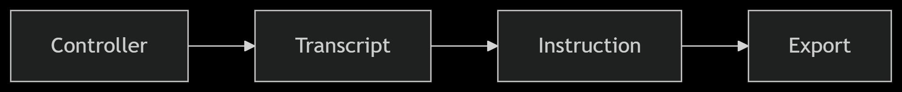

Here’s a professional and clear `README.md` file for your **YouTube Script Summarizer** project using CrewAI with Gemini:

---

````markdown
# 🎬 YouTube Script Summarizer with CrewAI 🤖

This project uses [CrewAI](https://docs.crewai.com/) with **Gemini LLM** to process YouTube videos by:
1. Extracting the transcript
2. Applying a user-defined instruction (e.g., summarization)
3. Exporting the result to PDF or Word

🔁 Tasks are executed **sequentially by specialized agents** to ensure modular, structured processing.

---

## ✨ Features

- ✅ Extract YouTube transcript automatically
- ✍️ Apply custom instructions (e.g., summarize, extract keywords)
- 📄 Export result as a Word or PDF document
- 🌗 Includes a Dark/Light mode toggle in the Streamlit UI
- 🌍 Supports Arabic and other RTL languages
- 🧠 Agentic architecture powered by [CrewAI](https://docs.crewai.com/)

---

## 🧠 Agent Architecture

This app is structured using `CrewBase`, which defines the following agents and tasks:

### 👥 Agents
- **Transcript Agent**: Fetches the full transcript of the YouTube video.
- **Instruction Agent**: Processes transcript based on user instruction.
- **Export Agent**: Converts the processed result into a PDF or Word document.

### ✅ Tasks
- `transcript_task`: Extracts transcript.
- `instruction_task`: Applies instruction on the transcript.
- `export_task`: Exports the result.

Each agent uses tools defined in `Crew_folder/Tools`, including:
- `fetch_transcript`
- `process_content`
- `export_content`

---

## 🛠️ Installation

1. **Clone the repository**
   ```bash
   git clone https://github.com/yourusername/youtube-script-summarizer.git
   cd youtube-script-summarizer
````

2. **Create a virtual environment and activate it**

   ```bash
   python -m venv venv
   source venv/bin/activate  # or venv\Scripts\activate on Windows
   ```

3. **Install dependencies**

   ```bash
   pip install -r requirements.txt
   ```

4. **Setup environment**
   Create a `.env` file and add your Gemini API key:

   ```
   GEMINI_API_KEY=your_gemini_key_here
   ```

---

## 🚀 Running the App

### 🧪 Run the Crew pipeline

```bash
python run_crew.py
```

### 🎨 Run the Streamlit UI

```bash
streamlit run app.py
```

---

## 📂 Project Structure

```
.
├── assets/                        # Static files (images, icons, etc.)
├── Crew_folder/
│   ├── config/                    # Configuration files (if any)
│   └── Tools/
│       ├── custom_tools.py       # Tool functions: fetch, process, export
│       └── crew.py               # Crew and agent definitions
├── output/
│   ├── final_document.pdf        # Final exported PDF
│   ├── output.docx               # Optional Word export
│   └── output.pdf                # Optional PDF export
├── .env                          # Environment variables (Gemini API key)
├── .gitignore                    # Files to ignore in version control
├── app.py                        # Streamlit app for user interaction
├── README.md                     # 📘 You’re reading it!
└── requirements.txt              # Python dependencies

```
## The flow ....


---

## 📌 Notes

* Ensure YouTube captions are enabled for the video, otherwise the transcript won't be fetched.
* Output is saved in the `output/` directory by default.

---

## 🧠 Future Improvements

* Add multilingual translation agent
* Incorporate validation agent to check YouTube URL validity
* Allow more advanced formatting for exports
* Support automatic keyword detection

---

## 👩‍💻 Made With

* [Python 🐍](https://www.python.org/)
* [CrewAI 🧠](https://docs.crewai.com/)
* [Gemini API 🌐](https://ai.google.dev/)
* [Streamlit 🎨](https://streamlit.io/)

---

## ❤️ Author

**Yasmin kadry**
📧 [yasminkadry@gmail.com](mailto:yasminkadry6720@gmail.com)
🔗 [LinkedIn](https://www.linkedin.com/in/yasmin-kadry/)
💻 [GitHub](https://github.com/yasminkadry)

